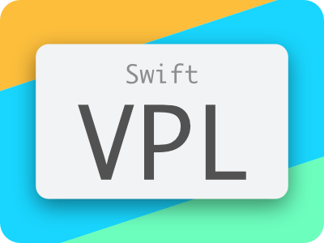
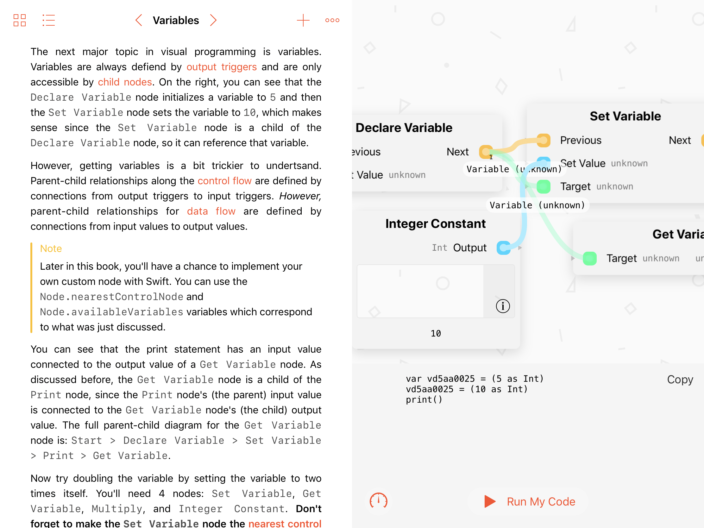

# Visual Programming Language

   
  <i>WWDC 2018 Scholarship Submission</i>

This project aims to create a node-based visual programming language that assembles to executable Swift code and can be written almost entirely using an Apple Pencil or touch.

## Screenshots

*The Swift Playground that walks through different aspects of the VPL.*

*The VPL running as a standalone application.*

A [video](Media/Short%20Demo.MP4) is also available of constructing a simple program.

## Discussion

I encourage you to try the playground and then try the standalone application. The playground explains many aspects of the VPL and shows you how to extend it.

This entire project was developed in around a week and – sadly – there is a limit to what I can do in a week. Because of that, there are many vital nodes that are missing that would be easy to add, especially pertaining to floating point math. **Pull requests are welcome.**

## Future Goals

This has been one of my dream projects for a long time now, but I don't have the time to turn this into something useful & usable at the moment.

If I were to continue development, I would likely integrate it into the iOS 11 document picker and allow the user to edit playgrounds directly in split view, similar to how the wonderful app [Force Unwrap](https://itunes.apple.com/app/id1347821944?mt=8) works.
